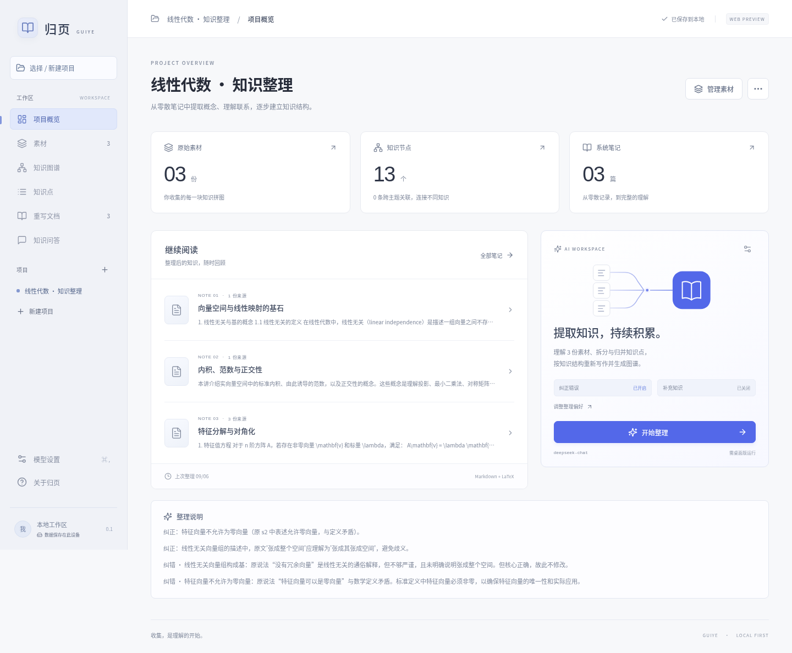

# 归页 · GUIYE

使用 **Rust + Vue 3 + Tauri 2** 开发的本地知识整理桌面应用。将零散记录与笔记文档整理成知识图谱、可追溯的系统笔记。

## 核心用途

归页用于**提取、归并并持续积累笔记中的知识点**。上传文件是输入素材；导出的知识文档由 AI 根据知识点重新写作。

- **项目选择**：没有活动项目时显示选择/新建页；删除最后一个项目后保持为空，不自动创建项目。示例项目需主动点击加载。
- **素材**：片段、文档、搜索与分页，显示待提取/已提取状态，可直接开始整理。
- **知识点**：直接新建、编辑标题和 Markdown / LaTeX 正文，无需添加素材片段；也可查看提取结果与原文证据，定位图谱或追问。
- **知识图谱**：主题层级与原子概念节点、跨主题关联，拖动平移、鼠标位置为中心的滚轮缩放、节点右键操作。
- **知识文档**：根据实际知识量生成一篇或多篇 Markdown/LaTeX 文档，支持编辑和导出。
- **知识问答**：根据素材、知识点和文档提问，引用可点击追溯，历史记录按项目保存。可把回答作为“待核实的新素材”加入项目，再继续提取。
- **模型设置**：模型地址、会话 Key、自定义提示词、纠错与补充开关。

素材、文档、知识点、图谱节点和编辑输入框提供相应右键菜单，拦截浏览器默认菜单。输入框剪贴板访问失败时可使用 Ctrl+C / Ctrl+V。

界面采用浅灰色导航与蓝色操作色。桌面窗口关闭系统标题栏（`decorations: false`），适合 Hyprland；窗口操作交给窗口管理器。



[项目选择](docs/screenshots/projects.png) · [知识点提取](docs/screenshots/knowledge.png) · [知识问答](docs/screenshots/chat.png) · [素材页面](docs/screenshots/sources.png) · [知识图谱](docs/screenshots/graph.png) · [知识文档](docs/screenshots/notes.png) · [模型设置](docs/screenshots/settings.png)

## 启动

需要 Node.js 22.12+、Rust stable，以及 [Tauri 2 系统依赖](https://v2.tauri.app/start/prerequisites/)。

```bash
npm install
npm run tauri -- dev
```

在已配置 `DEEPSEEK_API` 的 **fish 终端**内启动即可读取该环境变量。在「模型设置」里将 Key 留空。默认服务地址为 `https://api.deepseek.com`，默认模型为 `deepseek-chat`；也可填写自己的模型名称和兼容服务。

仅访问 **api.deepseek.com 的 HTTPS 默认端口**时自动使用 `DEEPSEEK_API`。自定义远端服务必须显式填写 Key，本机 HTTP 模型可不提供 Key。Key 不写入工作区、日志或导出文件。

仅预览界面：

```bash
npm run dev
```

打开 `http://127.0.0.1:1420`。浏览器预览支持项目、素材和笔记操作，使用 localStorage；AI 请求在 Tauri 的 Rust 后端执行，需要桌面版。浏览器与桌面版的工作区相互独立。

首次启动进入项目选择页。点击「查看示例项目」可体验旧示例图谱；要得到真实提取的知识点，需要在桌面版点击整理。

## 使用流程

1. 在项目选择页新建主题项目，添加笔记文档或随手记录。
2. 配置模型，按需开启纠错、补充，输入自定义提示词。
3. 在素材页或概览点击「开始整理」，查看真实处理阶段。
4. 在知识点页检查提取解释与逐字原文证据，在图谱中探索概念关系，导出重新编排的知识文档。
5. 后续持续添加素材，再次整理：未变素材复用之前提取的知识点及 ID，新增/修改素材重新提取，模型审阅已有文档后选择编辑、合并或新建；同主题小笔记可合并为大文档，更新时保留目标文档 ID。
6. 在知识问答页提问，或从文档/节点右键发起追问。回答可以先作为待核实素材加入，再决定是否整理进知识体系。

手动新建或编辑的知识点会保留正文与 ID，后续整理仅重新安排其位置，不参与 AI 纠错和合并；原素材删除或修改后会清除失效引用。保存知识点立即同步图谱，知识文档在下次整理时更新。只有手动知识点、没有素材的项目也能整理和问答。

重新整理会替换图谱和知识文档（含文档的手动编辑），操作前有提示；当前会话支持撤销最近一次成功整理；此后手动保存知识点会关闭这次撤销，以免丢失新修改。任何阶段失败都保留旧结果；处理期间素材或文档发生变化，也不会提交过期结果。桌面导出到系统下载目录，同名文件自动编号。

### 导入与公式

- UTF-8 文本：`.txt`、`.md`、`.markdown`、`.tex`、`.latex`、`.csv`、`.json`。
- 多文件选择、拖入文档；单文件最大 1 MB 且不超过 100,000 字符。
- `.tex`/`.latex` 作为文本素材交给模型，不执行 TeX，不展开外部 `\\input` 文件。
- PDF、Word、图片和 OCR 尚未实现。
- 输出支持 `$...$`、独占行的 `$$...$$`、`\\(...\\)` 和 `\\[...\\]` 数学表达式。
- KaTeX 与公式字体随应用打包，无需 CDN；Markdown 禁用 HTML 并通过 DOMPurify 清理。

### 多阶段 AI 处理

通过 [DeepSeek JSON Output](https://api-docs.deepseek.com/guides/json_mode/) 兼容的 Chat Completions API 调用模型，服务需支持 JSON Output。

1. **语义提取**：按完整 Markdown/LaTeX 块读取原文，公式、矩阵和公式环境不按行数或字符数拆开。模型提取中文概念名称及完整说明，一个原文块可以支撑多个概念，多个块也可共同支撑同一概念。程序按段落编号附上原文证据，正文不再用原文片段替代。
2. **结构与概念分离**：标题、编号、目录、文件名、排版命令等只作为理解上下文；表格、列表中的实际知识照常提取。缺失或残缺的概念会要求模型修正，不自动把遗漏段落填成知识点。同一概念在不同文件、不同语言中的重复定义会再做一次语义归并。
3. **知识文档**：统一规划主题目录，避免按原文件或处理批次拆成零散文档。关闭知识补充时按主题组织已提炼的完整概念说明；开启补充时允许写作模型补充并明确标记。两种模式均不强求最少字数或篇数，标题使用中文。

`knowledgePoints` 和 `sourceFingerprints` 持久化在整理结果中。素材指纹用于失效检查（不是安全哈希）；当前版本的未修改素材复用语义提取结果；旧版按行切片的缓存会失效，重新整理后升级。纠错结果保留原始提取，可在关闭纠错后按原材料重新整理。

提取异常最多自动要求修正两次，不能用原文切片冒充知识点；主题目录格式异常会重试，并可按已提炼的完整概念生成目录。结构中遗漏的知识点由程序补齐到图谱和文档，已删除素材的节点不会作为旧结构输入。一次最多 200 份素材、总计 100,000 字符、350 个提取知识点。每次模型请求超时 180 秒；整个多阶段任务可能需要数分钟，并消耗多次 API 调用。所有阶段进度会显示在界面。纠错与补充遵循开关，但模型语义与事实质量仍应结合原文核对。

### 知识问答

结合当前问题和最近追问，从素材、知识节点和知识文档中按文本相关性检索上下文，最多取 24 个片段（每片段最多 1600 字符），最近 8 条历史消息参与回答。可指定当前文档作为优先范围。

回答中的素材、节点、文档 ID 由 Rust 校验，不能引用本次上下文之外的条目。检索目前使用文本匹配，尚未接入向量数据库，跨术语/同义词问题可能遗漏相关内容，可通过具体文档发起问答缩小范围。

## 本地数据

桌面工作区由 Rust 保存到 Tauri 应用数据目录：

| 系统    | 默认位置                                                                        |
| ------- | ------------------------------------------------------------------------------- |
| Linux   | `$XDG_DATA_HOME/com.guiye.desktop/`，通常为 `~/.local/share/com.guiye.desktop/` |
| macOS   | `~/Library/Application Support/com.guiye.desktop/`                              |
| Windows | `%APPDATA%\com.guiye.desktop\`                                                  |

- `workspace.json`：全部项目与非敏感设置。
- `workspace.backup.json`：上一版成功保存前的工作区。
- 写入先写临时文件并同步，再重命名替换；发现原文件损坏时停止自动覆盖。
- 恢复备份：关闭应用，保留损坏文件副本，将 `workspace.backup.json` 复制为 `workspace.json`，再启动。
- 项目操作菜单可导出 JSON；此版本 JSON 导出用于数据留存，尚无项目备份导入界面（素材页导入 JSON 会作为原文素材）。

## 构建

```bash
npm run build
npm run tauri -- build --bundles deb
```

Linux 安装包位于 `src-tauri/target/release/bundle/deb/`，可执行文件位于 `src-tauri/target/release/guiye`。可执行文件包含前端资源，运行无需 Vite，但宿主系统仍需 WebKitGTK/GTK 依赖。

当前已在 Linux 上验证；macOS/Windows 需在对应系统构建、验证，当前 bundle 配置默认面向 Linux。

## 验证

```bash
# 前端类型与生产构建
npm run build

# Rust 结果校验与保存测试，不依赖 GUI
cargo test --manifest-path src-tauri/Cargo.toml --no-default-features

# 页面交互、公式、安全渲染、本地保存、桌面 IPC 模拟与响应式截图
npx playwright install chromium
npm test

# 真实 DeepSeek 集成测试：从含 DEEPSEEK_API 的 fish 终端执行，会消耗少量 API 额度
cargo run --manifest-path src-tauri/Cargo.toml --no-default-features --bin ai-smoke
```

真实集成测试使用线性代数素材（含一处错误定义），验证原子提取、纠错和逐篇重写。可用 `GUIYE_TEST_PREVIOUS` 指定之前的结果，设置 `GUIYE_TEST_INCREMENTAL=1` 增加一份内积素材并校验旧知识点 ID 未丢失；`GUIYE_TEST_QA=1` 同时测试真实问答。`GUIYE_TEST_QA_ONLY=1` 可复用旧结果只测试问答。`GUIYE_SMOKE_OUTPUT` 指定测试结果输出路径，文件不包含 Key。

## 代码结构

```text
src/
  App.vue                       页面导航、项目与素材/笔记交互
  components/KnowledgeGraph.vue SVG 知识树与关联关系
  components/ModelSettings.vue  独立模型设置页
  components/KnowledgeChat.vue  项目知识问答、引用与回答转素材
  api.ts                        Tauri IPC 与浏览器预览存储
  markdown.ts                   Markdown/LaTeX 渲染与 HTML 清理
  types.ts                      领域数据类型
  demo.ts                       示例项目
  style.css                     视觉样式与响应式布局
src-tauri/src/
  ai.rs                         提取、增量缓存、独立审校、知识归并、逐篇重写
  qa.rs                         上下文检索、问答与引用校验
  storage.rs                    本地工作区与备份
  lib.rs                        Tauri 命令
  bin/ai_smoke.rs                真实 AI 集成测试入口
tests/app.spec.ts              浏览器端到端测试
```

### 整理与操作说明

- 每个文件和片段均可点击「整理入库」，或右键选择「单独整理进知识库」。仅处理所选素材及已有知识库素材，其他待整理素材不会加入；状态按当前标题与内容显示「已整理 / 待整理」，修改后自动失效。
- 关闭纠错时保留原说法，包括错误公式；关闭补充关联知识时不增加定义、例子或知识点。调整偏好后重新整理即可应用。
- 左侧项目右键支持新建和删除。删除项目须完整输入项目名称；移除素材只需确认。删除入口统一使用红色，并置于项目菜单底部。
- 问答请求结束前输入框与提问入口锁定，切换页面也不会解除。
- DeepSeek V4 使用非思考模式，输出额度从 16384 tokens 起，截断后最多两次增加额度重试；提取和结构设计按小批次执行，避免一次输出整个大项目。


运行真实 DeepSeek 整理回归（使用人工测试素材，不访问工作区）：

```bash
cargo run --manifest-path src-tauri/Cargo.toml --no-default-features --bin organize_regression
```

需配置 `DEEPSEEK_API`，默认使用 `deepseek-v4-pro`，可用 `GUIYE_TEST_MODEL` 覆盖。验证首次整理、删除后再整理、修改后再整理、未修改缓存复用，以及原文证据、关闭纠错和删除素材不回流。

图谱默认节点尺寸固定为 184×56 像素，不再为了显示整张树自动缩小。通过平移、滚轮或缩放按钮浏览；键盘聚焦远处节点会自动定位。

语义质量真实回归（人工素材包含章节、目录、英文重复定义和多行 LaTeX）：

```bash
cargo run --manifest-path src-tauri/Cargo.toml --no-default-features --bin semantic_regression
```

### 连续整理的文档归并回归

```bash
cargo run --manifest-path src-tauri/Cargo.toml --no-default-features --bin incremental_regression
```

使用 `DEEPSEEK_API` 调用 `deepseek-v4-pro`，只发送程序内的合成笔记，比较一次整理两篇与分两次整理的文档数量、知识覆盖和已有文档 ID 保留情况。规划会收到已有文档标题、内容摘要和知识点归属；同主题优先编辑或合并，新建独立文档需给出理由。多数文档内容很少时会要求模型复审，减少把小节拆成单独文件。
